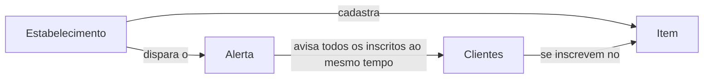

O Need Alert tem uma estrutura simples, que é a mesma para uma padaria, uma clínica ou uma loja virtual.

## Não é uma fila

O Need Alert não organiza ordem de atendimento. Não existe posição, senha, "você é o 5º" nem tempo estimado. As pessoas se inscrevem em algo que **ainda não aconteceu e não tem hora certa para acontecer**, e todas recebem o aviso juntas quando acontece.

| Ferramenta de fila | Need Alert |
|---|---|
| Organiza quem é atendido primeiro | Avisa todos os inscritos ao mesmo tempo |
| Mostra posição e tempo de espera | Não há posição: você é avisado quando acontece |
| Serve para quem já está no local, esperando a vez | Serve para quem quer saber quando algo ficar disponível, esteja onde estiver |

## Os conceitos

<AccordionGroup>
  <Accordion title="Estabelecimento" icon="store">
    A unidade que avisa os clientes: uma loja, um consultório, um cinema, uma unidade de uma rede. Cada estabelecimento tem sua equipe, seus itens e seu fuso horário.

    Se você tem várias unidades, todas ficam na mesma **rede**. A rede compartilha o saldo de créditos e o [catálogo de produtos](/estabelecimentos/catalogo-da-rede).
  </Accordion>
  <Accordion title="Item" icon="box">
    O que as pessoas esperam: um produto, um prato do dia, uma vaga de consulta, a estreia de um filme. Cada item pertence a um estabelecimento e tem um **QR Code** e um **link público** próprios, que não mudam.
  </Accordion>
  <Accordion title="Inscrição" icon="user-check">
    O pedido de uma pessoa para ser avisada sobre um item. Os **inscritos** de um item são todos que pediram esse aviso. Cada unidade tem os próprios inscritos: estoque, forno e agenda variam de loja para loja.

    Para se inscrever, a pessoa precisa ter uma conta no Need Alert.
  </Accordion>
  <Accordion title="Disparo (alerta)" icon="bell">
    O aviso que você envia quando o item fica disponível. Você pode disparar na hora ou [agendar](/estabelecimentos/agendar-disparos) para um horário futuro. Todos os inscritos recebem o aviso ao mesmo tempo.
  </Accordion>
  <Accordion title="Créditos" icon="coins">
    **1 crédito = 1 pessoa avisada.** Antes de confirmar um disparo, você vê quantas pessoas serão avisadas e quanto vai custar. Os créditos são pré-pagos e ficam no saldo da rede.
  </Accordion>
</AccordionGroup>

## Aviso único e aviso recorrente

Cada item tem um tipo de aviso, que define o que acontece com a inscrição depois do disparo.

| Tipo | Depois do disparo | Exemplos |
|---|---|---|
| **Aviso único** | A pessoa é avisada uma vez e a inscrição é encerrada. Para ser avisada de novo, ela se inscreve outra vez. | Pão de queijo, prato do dia, produto esgotado, vaga de consulta, estreia de filme |
| **Aviso recorrente** | A inscrição continua ativa e a pessoa pode ser avisada várias vezes. | Doadores de um tipo sanguíneo, reposição de um produto que sempre acaba |

## O que a pessoa escolhe ao se inscrever

Quem se inscreve define até quando quer ser avisado:

- **Até quando:** sem prazo, por 1 semana, 1 mês, 1 ano, ou até uma data. Vale para os dois tipos de aviso.
- **Quantas vezes avisar:** sempre que acontecer, ou um número de vezes. Só aparece em avisos recorrentes, porque o aviso único avisa uma vez.

Quando o número de avisos é atingido ou o prazo vence, a inscrição é encerrada automaticamente.

## Uma conta, dois papéis

No Need Alert, todo mundo tem a mesma conta. Uma pessoa pode se inscrever em itens e, com o mesmo login, administrar um estabelecimento. Quem cria um estabelecimento passa a ver **Meus estabelecimentos** no menu, ao lado de **Minhas inscrições**.
