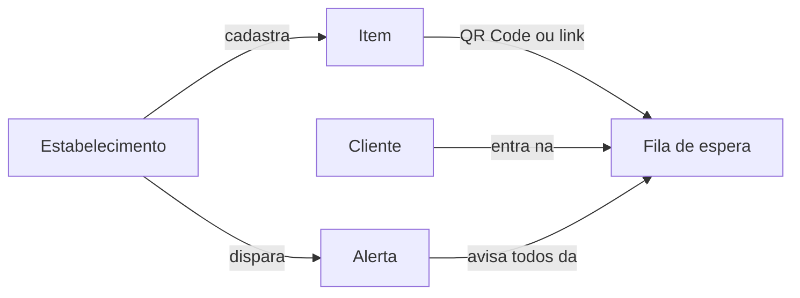

O Need Alert tem uma estrutura simples, que é a mesma para uma padaria, uma clínica ou uma loja virtual.

## Os conceitos

<AccordionGroup>
  <Accordion title="Estabelecimento" icon="store">
    A unidade onde seus clientes esperam: uma loja, um consultório, uma unidade de uma rede. Cada estabelecimento tem sua equipe, seus itens e seu fuso horário.

    Se você tem várias unidades, todas ficam na mesma **rede**. A rede compartilha o saldo de créditos e o [catálogo de produtos](/estabelecimentos/catalogo-da-rede).
  </Accordion>
  <Accordion title="Item" icon="box">
    O que as pessoas esperam: um produto, um prato do dia, uma vaga de consulta, uma turma. Cada item pertence a um estabelecimento e tem um **QR Code** e um **link público** próprios, que não mudam.
  </Accordion>
  <Accordion title="Fila de espera" icon="users">
    Quem quer ser avisado sobre um item. Cada item tem a sua fila, e a fila não é compartilhada entre unidades: estoque, forno e agenda variam de loja para loja.

    Para entrar numa fila, a pessoa precisa ter uma conta no Need Alert.
  </Accordion>
  <Accordion title="Disparo (alerta)" icon="bell">
    O aviso que você envia quando o item fica disponível. Você pode disparar na hora ou [agendar](/estabelecimentos/agendar-disparos) para um horário futuro. Todos que estão na fila recebem o aviso ao mesmo tempo.
  </Accordion>
  <Accordion title="Créditos" icon="coins">
    **1 crédito = 1 pessoa avisada.** Antes de confirmar um disparo, você vê quantas pessoas serão avisadas e quanto vai custar. Os créditos são pré-pagos e ficam no saldo da rede.
  </Accordion>
</AccordionGroup>

## Fila única e fila recorrente

Cada item tem um tipo de fila, que define o que acontece com a inscrição depois do aviso.

| Tipo | Depois do aviso | Exemplos |
|---|---|---|
| **Fila única** | A pessoa é avisada uma vez e sai da fila. Para ser avisada de novo, entra na fila outra vez. | Pão de queijo, prato do dia, produto esgotado, vaga de consulta |
| **Fila recorrente** | A pessoa continua na fila e pode ser avisada várias vezes. | Doadores de um tipo sanguíneo, reposição de um produto que sempre acaba |

## O que a pessoa escolhe ao entrar na fila

Quem entra na fila define até quando quer ser avisado:

- **Até quando:** sem prazo, por 1 semana, 1 mês, 1 ano, ou até uma data. Vale para os dois tipos de fila.
- **Quantas vezes avisar:** sempre que acontecer, ou um número de vezes. Só aparece em filas recorrentes, porque a fila única avisa uma vez.

Quando o número de avisos é atingido ou o prazo vence, a inscrição é encerrada automaticamente.

## Uma conta, dois papéis

No Need Alert, todo mundo tem a mesma conta. Uma pessoa pode esperar numa fila e, com o mesmo login, administrar um estabelecimento. Quem cria um estabelecimento passa a ver **Meus estabelecimentos** no menu, ao lado de **Minhas filas**.
