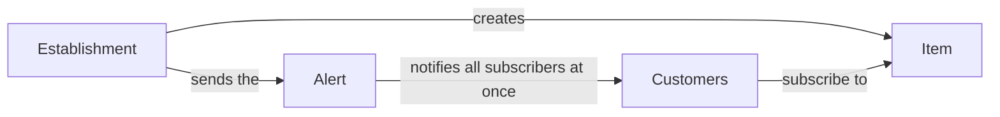

Need Alert has a simple structure, and it is the same for a bakery, a clinic, or an online store.

## It's not a queue

Need Alert doesn't manage who gets served first. There's no position, no ticket number, no "you're 5th", and no estimated wait. People subscribe to something that **hasn't happened yet and has no set time**, and everyone gets the alert together when it happens.

| Queue management tool | Need Alert |
|---|---|
| Decides who is served first | Notifies all subscribers at the same time |
| Shows position and wait time | No position: you're notified when it happens |
| For people already on site, waiting their turn | For people who want to know when something becomes available, wherever they are |

## The concepts

<AccordionGroup>
  <Accordion title="Establishment" icon="store">
    The unit that notifies customers: a shop, a practice, a cinema, a unit of a chain. Each establishment has its own team, items, and time zone.

    If you have several units, they all belong to the same **chain**. The chain shares the credit balance and the [product catalog](/en/establishments/chain-catalog).
  </Accordion>
  <Accordion title="Item" icon="box">
    What people wait for: a product, a dish of the day, an appointment slot, a movie release. Each item belongs to one establishment and has its own **QR code** and **public link**, which never change.
  </Accordion>
  <Accordion title="Subscription" icon="user-check">
    A person's request to be notified about an item. An item's **subscribers** are everyone who asked for that alert. Each unit has its own subscribers: stock, ovens, and schedules differ from shop to shop.

    Subscribing requires a Need Alert account.
  </Accordion>
  <Accordion title="Dispatch (alert)" icon="bell">
    The notification you send when the item becomes available. You can send it right away or [schedule it](/en/establishments/schedule-alerts) for later. All subscribers are notified at the same time.
  </Accordion>
  <Accordion title="Credits" icon="coins">
    **1 credit = 1 person notified.** Before confirming a dispatch, you see how many people will be notified and what it costs. Credits are prepaid and belong to the chain's balance.
  </Accordion>
</AccordionGroup>

## One-time and recurring alerts

Each item has an alert type, which defines what happens to a subscription after the dispatch.

| Type | After the dispatch | Examples |
|---|---|---|
| **One-time alert** | The person is notified once and the subscription closes. To be notified again, they subscribe again. | Fresh bread, dish of the day, out-of-stock product, appointment slot, movie release |
| **Recurring alert** | The subscription stays active and the person can be notified many times. | Donors of a blood type, restock of a product that always sells out |

## What people choose when subscribing

Whoever subscribes decides how long they want to be notified:

- **Until when:** no end date, for 1 week, 1 month, 1 year, or until a date. Applies to both alert types.
- **How many times to notify:** every time it happens, or a set number of times. Only shown for recurring alerts, since a one-time alert notifies once.

When the number of alerts is reached or the end date passes, the subscription closes automatically.

## One account, two roles

Everyone on Need Alert has the same kind of account. A person can subscribe to items and, with the same login, run an establishment. Once you create an establishment, **My establishments** shows up in the menu next to **My subscriptions**.
