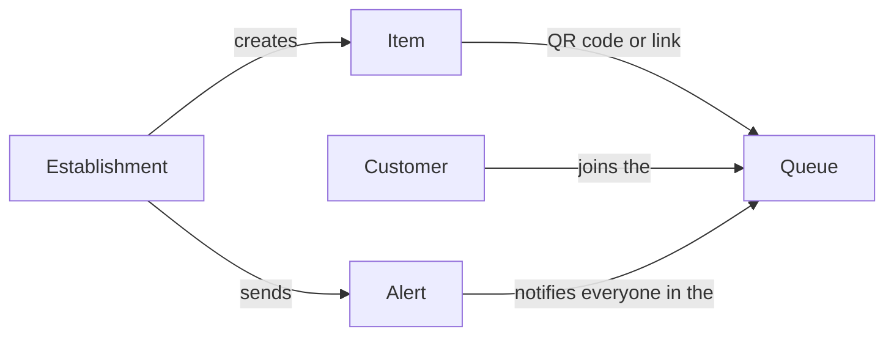

Need Alert has a simple structure, and it is the same for a bakery, a clinic, or an online store.

## The concepts

<AccordionGroup>
  <Accordion title="Establishment" icon="store">
    The place where your customers wait: a shop, a practice, a unit of a chain. Each establishment has its own team, items, and time zone.

    If you have several units, they all belong to the same **chain**. The chain shares the credit balance and the [product catalog](/en/establishments/chain-catalog).
  </Accordion>
  <Accordion title="Item" icon="box">
    What people wait for: a product, a dish of the day, an appointment slot, a class. Each item belongs to one establishment and has its own **QR code** and **public link**, which never change.
  </Accordion>
  <Accordion title="Queue" icon="users">
    The people who want to be notified about an item. Each item has its own queue, and queues are not shared between units: stock, ovens, and schedules differ from shop to shop.

    Joining a queue requires a Need Alert account.
  </Accordion>
  <Accordion title="Dispatch (alert)" icon="bell">
    The notification you send when the item becomes available. You can send it right away or [schedule it](/en/establishments/schedule-alerts) for later. Everyone in the queue is notified at the same time.
  </Accordion>
  <Accordion title="Credits" icon="coins">
    **1 credit = 1 person notified.** Before confirming a dispatch, you see how many people will be notified and what it costs. Credits are prepaid and belong to the chain's balance.
  </Accordion>
</AccordionGroup>

## Single and recurring queues

Each item has a queue type, which defines what happens to a subscription after the alert.

| Type | After the alert | Examples |
|---|---|---|
| **Single queue** | The person is notified once and leaves the queue. To be notified again, they join again. | Fresh bread, dish of the day, out-of-stock product, appointment slot |
| **Recurring queue** | The person stays in the queue and can be notified many times. | Donors of a blood type, restock of a product that always sells out |

## What people choose when joining

Whoever joins a queue decides how long they want to be notified:

- **Until when:** no end date, for 1 week, 1 month, 1 year, or until a date. Applies to both queue types.
- **How many times to notify:** every time it happens, or a set number of times. Only shown for recurring queues, since a single queue notifies once.

When the number of alerts is reached or the end date passes, the subscription closes automatically.

## One account, two roles

Everyone on Need Alert has the same kind of account. A person can wait in a queue and, with the same login, run an establishment. Once you create an establishment, **My establishments** shows up in the menu next to **My queues**.
